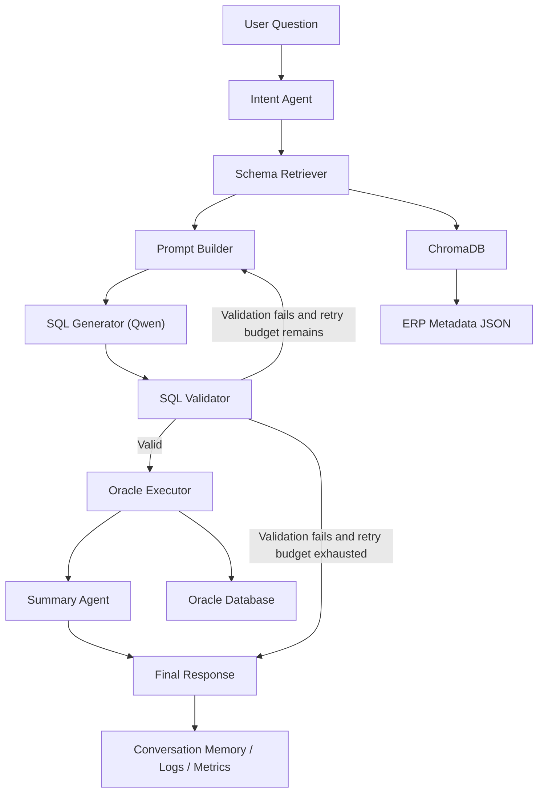

# ERP AI Agent

Production-oriented Oracle ERP AI agent with a Django backend and React frontend for real-time workflow visibility.

## Features

- local HuggingFace Qwen2.5-7B inference with streaming and prompt-template support
- LangChain-compatible schema retrieval over ChromaDB
- Oracle metadata loading, validation, and incremental vector indexing
- pooled Oracle connector with retries, read-only execution, parameterized queries, and DataFrame results
- LangGraph workflow with SQL validation retry paths
- runtime services for caching, conversation memory, SQL history, execution logs, metrics, prompt versioning, and rate limiting
- debug mode with per-node tracing, in-memory trace storage, colored console output, streamed state updates, and execution timeline reporting
- Django backend for workflow runs and trace/event streaming
- React dashboard for live workflow visualization using the existing observability stream
- Docker packaging and deployment documentation

## Quick start

1. Create a Python 3.11 virtual environment.
2. Install dependencies:

```powershell
pip install -r requirements.txt
```

3. Copy `.env.example` to `.env` and update the values.
4. Start the backend:

```powershell
.\venv\Scripts\python.exe manage.py runserver 127.0.0.1:8000
```

5. Start the frontend:

```powershell
cd frontend
npm.cmd install
npm.cmd run dev -- --host 127.0.0.1 --port 5173
```

## Architecture



## Project structure

- `agents/`: isolated workflow nodes
- `graph/`: LangGraph state and workflow assembly
- `llm/`: local Qwen adapter
- `retriever/`: metadata ingestion, embeddings, vector search
- `database/`: Oracle access abstractions
- `backend/`: core backend runtime, workflow orchestration, run/session management, and dashboard state projection
- `django_backend/`: Django project configuration
- `api/`: Django API routes and views
- `frontend/`: React monitoring dashboard
- `metadata/`: enterprise metadata artifacts split into raw, enriched, embeddings, and cache layers
- `metadata_models/`: typed dataclasses for tables, columns, relationships, business rules, and versions
- `services/`: Oracle extraction, metadata repository, and metadata loader services
- `scripts/`: CLI entrypoints for metadata extract, enrich, embedding build, and refresh flows
- `prompts/`: prompt templates
- `data/metadata/`: ERP table JSON definitions
- `utils/`: shared infrastructure utilities
- `tests/`: unit tests
- `docs/`: deployment documentation

## Enterprise metadata subsystem

The new metadata subsystem is intentionally separate from the current AI Agent logic. It extracts raw metadata from Oracle Data Dictionary views, enriches it with business-friendly knowledge, validates the output, and builds ChromaDB-ready embedding documents without modifying LangGraph, prompt templates, or SQL generation flow.

To let the existing agent consume the upgraded metadata without code changes, the enrichment flow also writes legacy-compatible JSON files into `metadata/agent_ready/`. Point `ERP_AGENT_METADATA_DIR` to that folder.

Run the metadata pipeline with:

```powershell
.\venv\Scripts\python.exe scripts\extract_metadata.py --owner APPS
.\venv\Scripts\python.exe scripts\enrich_metadata.py
.\venv\Scripts\python.exe scripts\build_embeddings.py
.\venv\Scripts\python.exe scripts\refresh_metadata.py --owner APPS
```

## Configuration management

All runtime settings are centralized in [config.py](/D:/test-ai-train/erp-ai-agent/config.py) and driven by [.env.example](/D:/test-ai-train/erp-ai-agent/.env.example). That includes:

- Oracle pool sizing, timeouts, retries, read-only mode, and optional client library path
- Oracle connection can be provided either as `ORACLE_DSN` or via `ORACLE_HOST` + `ORACLE_PORT` + `ORACLE_SERVICE_NAME`/`ORACLE_SID`
- LLM temperature, token budget, and context window
- vector-store persistence
- cache TTL, rate limit window, SQL validation retries, conversation memory size, and log directories

## Workflow notes

The LangGraph workflow is assembled in [graph/workflow.py](/D:/test-ai-train/erp-ai-agent/graph/workflow.py). It supports a retry loop when SQL validation fails: the validation feedback is fed back into the prompt builder, which regenerates SQL until the retry budget is exhausted.

## Debug mode

Observability is implemented in [utils/observability.py](/D:/test-ai-train/erp-ai-agent/utils/observability.py). When `DEBUG=true`, the workflow runs through `graph.stream(...)` and prints:

- node name
- start and end time
- execution time
- input and output state when `TRACE_STATE=true`
- prompt preview when `TRACE_PROMPTS=true`
- SQL text when `TRACE_SQL=true`
- warnings, errors, and a final execution timeline

Enable debug mode in `.env`:

```powershell
DEBUG=true
TRACE_SQL=true
TRACE_PROMPTS=true
TRACE_STATE=true
TRACE_TIMING=true
```

Disable it:

```powershell
DEBUG=false
TRACE_SQL=false
TRACE_PROMPTS=false
TRACE_STATE=false
TRACE_TIMING=false
```

Every run also produces an in-memory trace object containing the trace id, question, intent, retrieved tables, similarity scores, prompt, generated SQL, validation result, rows returned, final answer, errors, warnings, node traces, and execution timeline.

## React dashboard

The live dashboard is implemented in [frontend/src/App.jsx](/D:/test-ai-train/erp-ai-agent/frontend/src/App.jsx) with backend-side state/event reduction in [backend/dashboard_state.py](/D:/test-ai-train/erp-ai-agent/backend/dashboard_state.py). It consumes the existing observability events exposed by [api/views.py](/D:/test-ai-train/erp-ai-agent/api/views.py).

- current LangGraph node
- execution status
- retrieved ERP tables and similarity scores
- prompt sent to Qwen
- generated SQL and validation result
- Oracle execution time and returned rows
- final answer and total execution timeline
- expandable sections for prompt, SQL, state object, trace object, and raw LangGraph events

Run the frontend with:

```powershell
cd frontend
npm.cmd install
npm.cmd run dev -- --host 127.0.0.1 --port 5173
```

Run the backend with:

```powershell
.\venv\Scripts\python.exe manage.py runserver 127.0.0.1:8000
```

To connect the backend to your existing workflow entrypoint, set:

```powershell
$env:ERP_AGENT_WORKFLOW_RUNNER = "backend.runner:run_question"
```

This project now includes [backend/runner.py](/D:/test-ai-train/erp-ai-agent/backend/runner.py), and the backend uses it by default through the static path `backend.runner:run_question`. The caller only needs to provide the question; the runner builds the workflow, agents, retriever, LLM, and initial state internally.

## Tests

Run the lightweight test suite:

```powershell
python -m unittest tests.test_schema_loader tests.test_vector_store tests.test_runtime_services tests.test_observability tests.test_dashboard_controller
```

Dependency-backed tests such as the Oracle connector test are included but may be skipped until packages are installed.

## Deployment

See [docs/DEPLOYMENT.md](/D:/test-ai-train/erp-ai-agent/docs/DEPLOYMENT.md) for local and Docker deployment steps.
